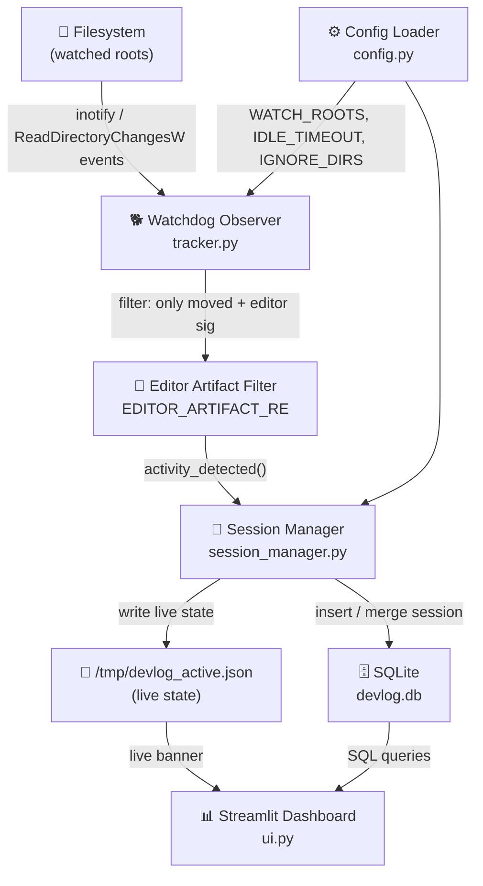
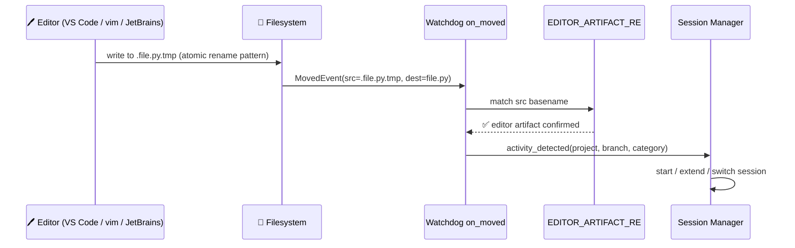
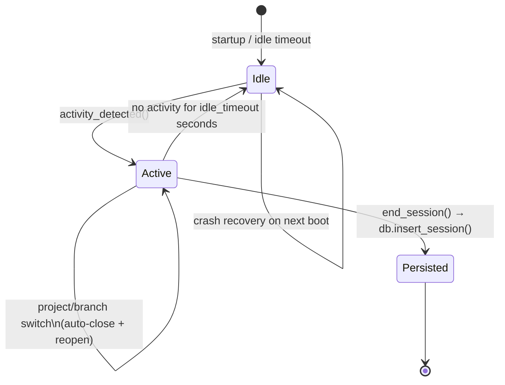

# ⏱️ DevLog

> **Zero-touch coding session tracker.** DevLog watches your filesystem, detects real human edits via editor artifact signatures, and silently logs every coding session to SQLite — no start/stop buttons, no timers, no friction.

<p align="center">
  
  
  
  
  
</p>

---

## ✨ Key Features

| Feature | Description |
|---|---|
| 🤖 **Zero-Touch Tracking** | Detects real edits via editor artifact signatures (vim, VS Code, JetBrains, Emacs). Bots are ignored. |
| 🔭 **Dynamic Project Discovery** | Automatically discovers every subfolder inside your watch roots as a separate project. |
| 🗂️ **Categorization** | Tag root folders as `work`, `personal`, `freelance` — filter everything by category. |
| 🌿 **Git Integration** | Captures the active branch per session. Branch switches auto-close and reopen sessions. |
| 🔀 **Smart Session Merging** | Short gaps between sessions on the same project are merged into one focused block. |
| 💥 **Crash Recovery** | Orphaned sessions from unexpected shutdowns are recovered on next startup. |
| 📊 **Rich Analytics Dashboard** | Heatmaps, donuts, peak-hours chart, streaks, deep-work scoring — all in Streamlit. |
| 🐧 **Linux / Windows** | systemd services on Linux; Windows Startup folder on Windows. |

---

## 🏗️ Architecture



---

## 🔬 How Session Detection Works

DevLog never tracks raw `on_modified` events (too noisy — build tools, linters, and formatters all fire those). Instead it uses a precise two-stage filter:



> Only `on_moved` events whose **source** matches the editor artifact regex are counted. This eliminates phantom sessions from CI, bundlers, package managers, and any non-human writer.

---

## 🔄 Session Lifecycle



---

## 📁 Project Structure

```
DevLog/
├── tracker.py          # Watchdog observer + editor artifact filter
├── session_manager.py  # Session lifecycle, idle detection, crash recovery
├── db.py               # SQLite init, insert, and session-merge logic
├── config.py           # Centralized config loader + logging setup
├── ui.py               # Streamlit analytics dashboard
├── config.json         # Your watch roots, timeouts, ignore list
├── config.example.json # Starter template
├── install_startup.py  # Windows Startup folder registration
├── retrospective_cleanup.py  # Data-integrity utility
└── devlog.db           # Auto-created SQLite database
```

---

## ⚙️ Configuration

```json
{
  "watch_roots": {
    "/home/you/projects": "personal",
    "/home/you/work":     "work"
  },
  "idle_timeout_seconds": 300,
  "merge_gap_seconds":    300,
  "min_session_seconds":  10,
  "cross_project_merge":  false,
  "ignore_dirs": [
    "node_modules", ".git", "__pycache__",
    ".next", "dist", "build", ".venv", "logs"
  ]
}
```

| Key | Type | Default | Description |
|---|---|---|---|
| `watch_roots` | `object` | `{}` | Map of `{ "abs/path": "category" }`. Each immediate subfolder is a project. |
| `idle_timeout_seconds` | `int` | `300` | Inactivity window before a session is closed. |
| `merge_gap_seconds` | `int` | `300` | Gap between sessions on the same project that gets merged into one block. |
| `min_session_seconds` | `int` | `10` | Sessions shorter than this are discarded as noise. |
| `cross_project_merge` | `bool` | `false` | Allow merging sessions across different projects when computing deep-work blocks. |
| `ignore_dirs` | `string[]` | see above | Directory names to skip entirely (avoids CPU spikes from build tools). |

> **Legacy format:** A flat `"watch": ["/path"]` array is still supported and mapped to category `"default"` automatically.

---

## 🚀 Quick Start

### Linux / macOS

```bash
git clone https://github.com/you/DevLog && cd DevLog
python3 -m venv .venv && source .venv/bin/activate
pip install -r requirement.txt
cp config.example.json config.json   # then edit with your paths
python3 tracker.py &                 # background tracker
streamlit run ui.py --server.port 8501 --server.headless true
```

### Windows

```powershell
python -m venv .venv
.\.venv\Scripts\Activate
pip install -r requirement.txt
copy config.example.json config.json  # then edit with your paths
python tracker.py                     # tracker in one terminal
streamlit run ui.py                   # dashboard in another
```

#### One-click autostart on login (Windows)
```powershell
python install_startup.py
```
Drops `DevLogTracker.cmd` into `%APPDATA%\Microsoft\Windows\Start Menu\Programs\Startup` — tracker launches automatically with `pythonw.exe` (no console window).

---

## 🛡️ systemd Services (Linux)

<details>
<summary><strong>devlog-tracker.service</strong></summary>

```ini
[Unit]
Description=DevLog Background Tracker
After=network.target

[Service]
Type=simple
User=devlog
WorkingDirectory=/opt/DevLog
ExecStart=/opt/DevLog/.venv/bin/python tracker.py
Restart=always
RestartSec=5

[Install]
WantedBy=multi-user.target
```
</details>

<details>
<summary><strong>devlog-ui.service</strong></summary>

```ini
[Unit]
Description=DevLog Streamlit Dashboard
After=network.target

[Service]
Type=simple
User=devlog
WorkingDirectory=/opt/DevLog
ExecStart=/opt/DevLog/.venv/bin/python -m streamlit run ui.py \
          --server.port 8501 --server.headless true
Restart=always
RestartSec=5

[Install]
WantedBy=multi-user.target
```
</details>

```bash
sudo systemctl daemon-reload
sudo systemctl enable --now devlog-tracker devlog-ui
```

---

## 📊 Analytics Dashboard

Launch with:
```bash
streamlit run ui.py
# → http://localhost:8501
```

### Dashboard Panels

```
┌─────────────────────────────────────────────────────────────┐
│  ⚡ Currently Tracking: DevLog  (personal) │ Branch: main   │
├──────────────┬──────────────┬──────────────┬────────────────┤
│ Total Time   │ Avg Session  │ Deep Work    │ Focus Score    │
│   14h 22m    │    28m       │   11.4h      │    79%         │
├──────────────┴──────────────┴──────────────┴────────────────┤
│ 🔥 Streak: 7d  │ 🏆 Best: 14d  │ 📅 Today: 2h  │ Yesterday │
├─────────────────────────────────────────────────────────────┤
│  📋 Session Log  │  📊 Analytics  │  🧠 Insights            │
└─────────────────────────────────────────────────────────────┘
```

| Chart | Description |
|---|---|
| 📆 **Daily Heatmap** | Bar chart of daily hours with 7-day rolling average overlay. |
| 📁 **Time per Category** | Donut chart — how time splits across `work`, `personal`, etc. |
| 🗂️ **Time per Project** | Donut chart — which projects dominate your time. |
| 🕐 **Peak Coding Hours** | 24-hour bar chart — find your golden hours. |
| 📅 **Day-of-Week Pattern** | Weekly bar chart — are you a weekday warrior or weekend coder? |
| 🧠 **Coder Persona** | Auto-detected: Night Owl 🦉, Early Bird 🐦, Afternoon/Evening Warrior ☀️. |
| ⏱️ **Session Depth Table** | Per-project average session length + session count. |

---

## 🧰 Tech Stack

| Layer | Technology |
|---|---|
| File watching | [Watchdog](https://github.com/gorakhargosh/watchdog) (inotify / FSEvents / ReadDirectoryChangesW) |
| Storage | SQLite via `sqlite3` stdlib |
| Dashboard | [Streamlit](https://streamlit.io) |
| Charts | [Plotly Express](https://plotly.com/python/plotly-express/) + Plotly Graph Objects |
| Data wrangling | [Pandas](https://pandas.pydata.org) + NumPy |
| Config | Plain JSON (`config.json`) |

---

## 🗄️ Database Schema

```sql
CREATE TABLE sessions (
  id         INTEGER PRIMARY KEY AUTOINCREMENT,
  project    TEXT,           -- folder name (e.g. "DevLog")
  start_time TEXT,           -- ISO-8601 datetime
  end_time   TEXT,           -- ISO-8601 datetime
  duration   INTEGER,        -- seconds
  git_branch TEXT,           -- active branch at session start
  category   TEXT            -- inherited from watch_roots mapping
);
```

Sessions within `merge_gap_seconds` of each other (same project + branch) are **merged in-place** — a short bio-break won't fragment your focus block into dozens of tiny entries.

---

## 🤝 Contributing

1. Fork → feature branch → PR against `main`.
2. Keep new config keys backward-compatible (default values in `config.py`).
3. Run `python test_watch.py` before opening a PR.

---

## 📄 License

MIT — do whatever you want. A ⭐ is appreciated if this saves you time.
